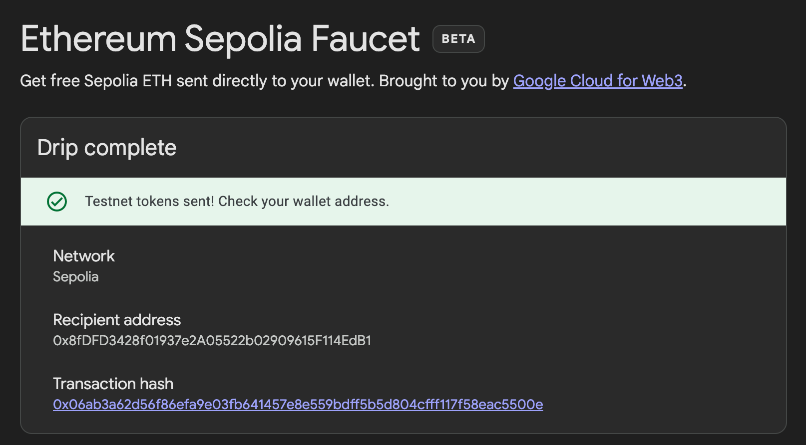

# Transfer 

## ToDO
- [ ] Generate address on Sepolia Testnet
- [ ] Get faucet
- [ ] Transfer on Sepolia Testnet

## Generate address on Sepolia Testnet
Run the code:
- Typescript: `/src/generateAddress.ts`

## Get Faucet on Seploa Testnet

Google: https://cloud.google.com/application/web3/faucet/ethereum/sepolia

Result(example)

